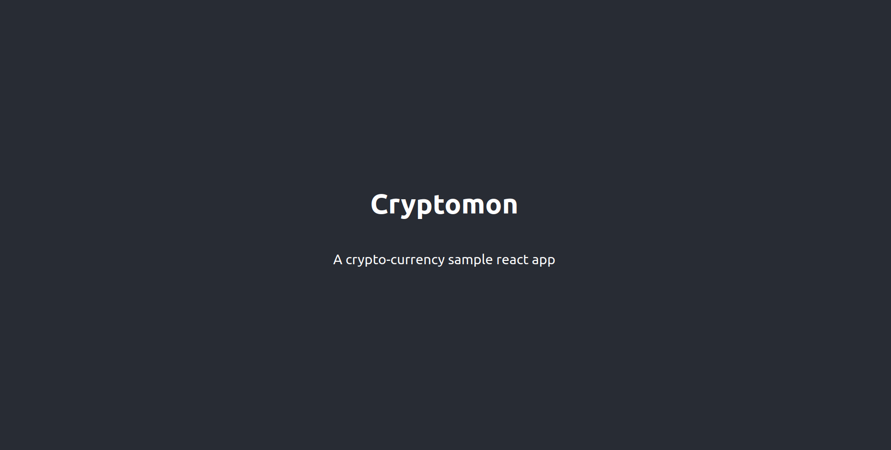

# Integrating Zilliqa with React

So far, in Chapter 1, we covered Scilla; Zilliqa's smart contract langauge. In Chapter 2, we covered Zilliqa API and Zilliqa JS, both of which help us communicate with the Zilliqa blockchain and fetch contract state.

In this final section of the TLDR course, we will walk-through the steps to develop a simple React DApp that will combine all our knowledge from the previous chapters. This DApp will demonstrate how to fetch contract state and rendered it on the UI and also calling transitions with buttons.

#### Step 1

First, we are going to create a sample react app

Open a terminal and execute the following:

```bash
npx create-react-app cryptomon
```

#### Step 2

Copy and replace the following code for `App.js`

```javascript title="/cryptomon/src/App.js"
import './App.css';

function App() {
  return (
    <div className="App">
      <header className="App-header">
        <h1>Cryptomon</h1>
        <p>A crypto-currency sample react app</p>
      </header>
    </div>
  );
}

export default App;
```

Now, let's run the project:

```bash
cd cryptomon
npm run start
```

Browse to http://localhost:3000, it should look something like this:




#### Step 3

Now, we have to deploy the Cryptomon contract.

Download this [**Cryptomon**](https://github.com/teye/zilliqa-tldr-dapp-course/tree/main/exercises/chapter3/cryptomon.scilla) contract and head to [**Neo Savant IDE**](https://ide.zilliqa.com).

On Neo-Savant IDE, select **Testnet** and deploy this contract.

Take note of the contract address.

Next, select the deployed contract on Neo-Savant IDE. 

Execute `AddCryptoMon`, set the `token_id` to `1` and the `address` to your wallet address. 

Once the transaction is confirmed, check the state on Devex Zilliqa or ViewBlock to ensure that the new token id is added to `token_owners` map.

#### Step 4

Next, let's return back to our **react app**. 

We are going to add **Zilliqa JS** so that we can fetch the `token_owners` and display it on our react app.

Open a terminal and change to the react app directory execute the following:

```
npm install @zilliqa-js/zilliqa
```

#### Step 5

Edit `App.js` and add the following code to create a new state variable:

```javascript title="/cryptomon/src/App.js
import { useState } from 'react';
import './App.css';

function App() {
  const [data, setData] = useState([]);

  return (
    <div className="App">
      <header className="App-header">
        <h1>Cryptomon</h1>
        <p>A crypto-currency sample react app</p>
      </header>
    </div>
  );
}

export default App;
```

The `data` variable is going to store our `token_owners`.

<br/>

Next, let's import the Zilliqa module.

```javascript title="/cryptomon/src/App.js
import { useState } from 'react';
import './App.css';

const { Zilliqa } = require('@zilliqa-js/zilliqa');


async function fetchTokenOwners() {
  const zilliqa = new Zilliqa('https://dev-api.zilliqa.com');
  const cryptomonAddr = '0x_contract_addr';
  
  const owners = await zilliqa.blockchain.getSmartContractSubState(
      `${cryptomonAddr}`,
      'token_owners',
  );

  return owners;
}

function App() {
  const [data, setData] = useState([]);

  return (
    <div className="App">
      <header className="App-header">
        <h1>Cryptomon</h1>
        <p>A crypto-currency sample react app</p>
      </header>
    </div>
  );
}

export default App;
```

We imported the **Zilliqa** module and create a `fetchTokenOwners()` function that fetches the `token_owners` field.

Edit the `0x_contract_addr` to your deployed contract address:

```javascript
const cryptomonAddr = '0x_contract_addr';
```

Next, we have to call `fetchTokenOwners()` when the page load initially. 

Import `useEffect` and add the following code to `App.js`:

```javascript title="/cryptomon/src/App.js
import { useState, useEffect } from 'react';
import './App.css';

const { Zilliqa } = require('@zilliqa-js/zilliqa');


async function fetchTokenOwners() {
  const zilliqa = new Zilliqa('https://dev-api.zilliqa.com');
  const cryptomonAddr = '0x_contract_addr';
  
  const owners = await zilliqa.blockchain.getSmartContractSubState(
      `${cryptomonAddr}`,
      'token_owners',
  );

  return owners;
}

function App() {
  const [data, setData] = useState([]);
  const [loading, setLoading] = useState(false);

  useEffect(() => {
    let owners = [];

    setLoading(true);

    fetchTokenOwners()
      .then((res) => {
        if (res.result) {
          for (const [token_id, owner_address] of Object.entries(res.result.token_owners)) {
            owners.push({
              token_id: token_id,
              owner: owner_address,
            })
          }
        }
      })
      .catch((err) => {
        console.error(err);
      })
      .finally(() => {
        console.log(owners);
        setData([...owners]);
        setLoading(false);
      })
  }, []);

  return (
    <div className="App">
      <header className="App-header">
        <h1>Cryptomon</h1>
        <p>A crypto-currency sample react app</p>
      </header>
    </div>
  );
}

export default App;
```

The `useEffect` code block fetches the `token_owners` on page load. The data is converted into an `array` of JSON object in the format `[{ token_id_1, owner_address_1 }, { token_id_2, owner_address_2 }, ... ]` and store in a React state variable `data`.

#### Step 6

Next, we can render the data to show on the UI.

Replace the following code in the `return (...)` section in `App.js`:

```javascript title="/cryptomon/src/App.js
<header className="App-header">
<h1>Cryptomon</h1>
<p>A crypto-currency sample react app</p>

{
    loading ?
    <p>Loading cryptomons...</p> :

    (
    data &&
    data.length > 0 &&
    data.map((item) => (
        <div key={item.token_id}>
        <span>Token ID: {item.token_id}&nbsp;&nbsp;Owner: {'0x<wallet-address>'}</span>
        </div>
    ))
    )
}
</header>
```

Run the DApp, it should display the token IDs and owners:


#### Step 7

Next, we are going to add a button that will invoke `AddCryptoMon` using ZilliqaJS.

Add a `button` code under `return (...)` section in `App.js`:

```javascript title="/cryptomon/src/App.js
  return (
    <div className="App">
      <header className="App-header">
        <h1>Cryptomon</h1>
        <p>A crypto-currency sample react app</p>

        {
          loading ?
          <p>Loading cryptomons...</p> :

          (
            data &&
            data.length > 0 &&
            data.map((item) => (
              <div key={item.token_id}>
                <span>Token ID: {item.token_id}&nbsp;&nbsp;Owner: {'0x<wallet-address>'}</span>
              </div>
            ))
          )
        }

        <p></p>
        <button onClick={() => onAddCryptoMon()}>Add CryptoMon</button>
      </header>
    </div>
  );
```

The button will call a `onAddCryptoMon` handler function.

Now, let's add the actual `AddCryptoMon` call as a new function.

```javascript title="/cryptomon/src/App.js
// async function fetchTokenOwners() ...

async function AddCryptoMon(token_id, address) {
  const zilliqa = new Zilliqa('https://dev-api.zilliqa.com');
  const privateKey = process.env.REACT_APP_PRIVATE_KEY;
  const cryptomonAddr = process.env.REACT_APP_CRYPTOMON_ADDR;

  zilliqa.wallet.addByPrivateKey(privateKey);
  const myGasPrice = units.toQa('2000', units.Units.Li);

  try {
    const networkId = await zilliqa.network.GetNetworkId();
    console.log("networkid: %o", networkId.result);

    const VERSION = bytes.pack(parseInt(networkId.result), 1);

    const contract = zilliqa.contracts.at(cryptomonAddr);
    const callTx = contract.call(
        'AddCryptoMon',
        [
            {
                vname: "token_id",
                type: "Uint256",
                value: `${token_id}`,
            },
            {
                vname: "address",
                type: "ByStr20",
                value: `${address}`,
            },
        ],
        {
            version: VERSION,
            amount: new BN(0),
            gasPrice: myGasPrice,
            gasLimit: Long.fromNumber(5000),
        },
        33,
        1000,
        false
    );

    return callTx;
  } catch (err) {
    console.error(err);
  }
}
```

The above code uses Zilliqa JS and reads the private key and contract address from the `.env` file. For safety reasons, private keys should not be hardcoded into the application.

Next, we create a `.env` file:

```bash title="/cryptomon/.env
REACT_APP_PRIVATE_KEY=my_private_key
REACT_APP_WALLET_ADDRESS=0x_my_wallet_address
REACT_APP_CRYPTOMON_ADDR=0x_contract_addr
```

Now, return back to `App.js`. In the main `App()` function, we need to code the `onAddCryptoMon` handler that would invoke this `AddCryptoMon` function when users click on the button.

```javascript title="/cryptomon/src/App.js
function App() {
    // state variables

    // useEffect

    // fetchTokenOwners()

    const onAddCryptoMon = () => {
        AddCryptoMon(3, process.env.REACT_APP_WALLET_ADDRESS)
        .then(async (res) => {
            console.log(res);
            if (res.receipt.success) {
            // add success
            // fetch new token owners
            }
        })
        .catch((err) => {
            console.error(err);
        })
   }

   // return (
   //   <div></div>
   // )
}
```

The above onhandler code invokes `AddCryptoMon` and `fetchTokenOwners` to fetch the updated `token_owners` state and display on page.

The full `App.js` should look like this:

```javascript title="/cryptomon/src/App.js
import { useState, useEffect } from 'react';
import './App.css';

const { bytes, BN, Long, units } = require('@zilliqa-js/util');
const { Zilliqa } = require('@zilliqa-js/zilliqa');


async function fetchTokenOwners() {
  const zilliqa = new Zilliqa('https://dev-api.zilliqa.com');
  const cryptomonAddr = process.env.REACT_APP_CRYPTOMON_ADDR;
  
  const owners = await zilliqa.blockchain.getSmartContractSubState(
      `${cryptomonAddr}`,
      'token_owners',
  );

  return owners;
}

async function AddCryptoMon(token_id, address) {
  const zilliqa = new Zilliqa('https://dev-api.zilliqa.com');
  const privateKey = process.env.REACT_APP_PRIVATE_KEY;
  const cryptomonAddr = process.env.REACT_APP_CRYPTOMON_ADDR;

  zilliqa.wallet.addByPrivateKey(privateKey);
  const myGasPrice = units.toQa('2000', units.Units.Li);

  try {
    const networkId = await zilliqa.network.GetNetworkId();
    console.log("networkid: %o", networkId.result);

    const VERSION = bytes.pack(parseInt(networkId.result), 1);

    const contract = zilliqa.contracts.at(cryptomonAddr);
    const callTx = contract.call(
        'AddCryptoMon',
        [
            {
                vname: "token_id",
                type: "Uint256",
                value: `${token_id}`,
            },
            {
                vname: "address",
                type: "ByStr20",
                value: `${address}`,
            },
        ],
        {
            version: VERSION,
            amount: new BN(0),
            gasPrice: myGasPrice,
            gasLimit: Long.fromNumber(5000),
        },
        33,
        1000,
        false
    );

    return callTx;
  } catch (err) {
    console.error(err);
  }
}

function App() {
  const [data, setData] = useState([]);
  const [loading, setLoading] = useState(false);

  useEffect(() => {
    let owners = [];

    setLoading(true);

    fetchTokenOwners()
      .then((res) => {
        if (res.result) {
          for (const [token_id, owner_address] of Object.entries(res.result.token_owners)) {
            owners.push({
              token_id: token_id,
              owner: owner_address,
            })
          }
        }
      })
      .catch((err) => {
        console.error(err);
      })
      .finally(() => {
        console.log(owners);
        setData([...owners]);
        setLoading(false);
      })
  }, []);

  const onUpdateTokenOwners = () => {
    let owners = [];
    
    fetchTokenOwners()
      .then((res) => {
        if (res.result) {
          for (const [token_id, owner_address] of Object.entries(res.result.token_owners)) {
            owners.push({
              token_id: token_id,
              owner: owner_address,
            })
          }
        }
      })
      .catch((err) => {
        console.error(err);
      })
      .finally(() => {
        console.log(owners);
        setData([...owners]);
        setLoading(false);
      })
  }

  const onAddCryptoMon = () => {
    AddCryptoMon(6, process.env.REACT_APP_WALLET_ADDRESS)
      .then(async (res) => {
        console.log(res.receipt);
        if (res.receipt.success) {
          // add success
          // fetch new token owners
          await onUpdateTokenOwners();
        }
      })
      .catch((err) => {
        console.error(err);
      })
  }

  return (
    <div className="App">
      <header className="App-header">
        <h1>Cryptomon</h1>
        <p>A crypto-currency sample react app</p>

        {
          loading ?
          <p>Loading cryptomons...</p> :

          (
            data &&
            data.length > 0 &&
            data.map((item) => (
              <div key={item.token_id}>
                <span>Token ID: {item.token_id}&nbsp;&nbsp;Owner: {item.owner}</span>
              </div>
            ))
          )
        }

        <p></p>
        <button onClick={() => onAddCryptoMon()}>Add CryptoMon</button>
      </header>
    </div>
  );
}

export default App;
```

#### Step 8

Run the project, and click on the `AddCryptoMon` button. You may need to edit `AddCryptoMon(6, process.env.REACT_APP_WALLET_ADDRESS)` and change the `token_id` to other numbers if it has been used.

Open dev tools and wait for a 1-2 minutes for the transaction to be confirmed. You should see the transaction output in the browser's developer tools.

Once the transaction is confirmed, it will re-rendered the page.

<br/>
<br/>

You may download and run the full code [**sample project**](https://github.com/teye/zilliqa-tldr-dapp-course/tree/main/exercises/chapter3/cryptomon). 

The full code has additional features such as auto calculating the next available `token_id` and also disabling the button when it is adding the cryptomon. 

Remember to set your `.env` file before running the project!