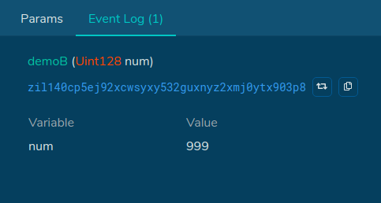
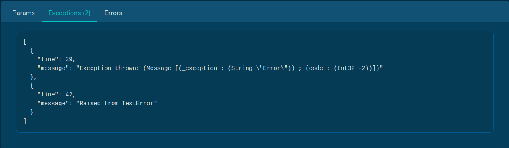

# Events & Errors
In some of the eariler topics, we already saw some events outputs. In this section, we are going to introduce Scilla events and how to throw errors exception in greater details.

## Events
A Scilla event is an output of a function call. Normally, we used it to output mutable field values after updating them. Scilla events can be read from the blockchain transaction receipt.

#### Syntax
```
  transition transitionName()
    e = {_eventname: "EventName"; field: "your_msg"}
    event e
  end
```

To output events, we first declare an `e` object and use the `_eventname` keyword. Next, we need to give this event a name and also add the contents that will be output. Finally, we emit the event by calling `event e`.

#### Example
```
  transition demoA()
   e = {_eventname: "demoA"; msg: "hello, I am a Scilla event"};
   event e
  end
```

```
  transition demoB(input: Uint128)
    e = {_eventname: "demoB"; num: input}
    event e  
  end
```

Above are some examples how events can be used. An event can output any types as long as the types are valid. For instance in `demoB`, we can output a `Uint128` supplied by the user.

To view the events output, we can view the transaction state on blockchain explorer such as [**Devex Zilliqa**](https://devex.zilliqa.com) and [**ViewBlock**](https://viewblock.io/zilliqa).

An example of invoking the transition `demoB` looks like this on Devex Zilliqa under "Event Logs" section:



## Errors
In Scilla, learning how to throw errors is also essential to contract writing. Frequently, we would have some checks and depending on the result of the checks, we would proceed to do something or throw an error to halt the contract execution.

#### Syntax
```
scilla_version 0

library DemoError

(* Error events *)
type Error =
| CodeNotOwner
| CodeNotFound
| CodeAlreadyExists

(* Library function that maps Error to a error code *)
let make_error =
  fun (result : Error) =>
    let result_code =
      match result with
      | CodeNotOwner       => Int32 -1
      | CodeNotFound       => Int32 -2
      | CodeAlreadyExists  => Int32 -3
      end
    in
    { _exception : "Error"; code : result_code }


contract DemoError()

field products : Map Uint128 String : Emp Uint128 String

(* Emit Errors *)
procedure ThrowError(err : Error)
  e = make_error err;
  throw e
end

transition AddItem(id: Uint128, name: String)
  product_name <- products[id];
  match product_name
  | Some existing_product =>
    (* item already exists; throw error *)
    err = CodeAlreadyExists;
    ThrowError err
  | None =>
    (* no existing item; proceed to add to map *)
    products[id] := name
  end
end
```

In the above transition `AddItem()`, it checks if the item already eixsts for the specific id, if so we throw a `CodeAlreadyExists` error. Otherwise, we add the item into the map.

Let's take a look at how the error is declared and thrown.

```
(* Error events *)
type Error =
| CodeNotOwner
| CodeNotFound
| CodeAlreadyExists

(* Library function that maps Error to a error code *)
let make_error =
  fun (result : Error) =>
    let result_code =
      match result with
      | CodeNotOwner       => Int32 -1
      | CodeNotFound       => Int32 -2
      | CodeAlreadyExists  => Int32 -3
      end
    in
    { _exception : "Error"; code : result_code }
```

First, we declare a **Custom ADT** (Custom Abstract Data Type) which is something like a custom object that defines an `Error` object. Our custom `Error` object has 3 attributes or definitions that determines what error type we can throw. The error type namings can be any names and has no limits to the number of errors that can be defined.

Next, we defined a library function `make_error` which maps our `Error` types into a `Int32` number and also outputs the mapping into the form `{_exception : "Error"; code : result_code }`.

We can think of this library function like a Javascript JSON, e.g.
```
  {
    CodeNotOwner : -1,
    CodeNotFound : -2,
    CodeAlreadyExists : -3,
  }
```

This mapping allow us to compare errors easily and also makes it easier to read in transaction outputs. In the example, we have used a negative number. There isn't a strict rule to use a negative number for error codes, positive numbers are also allowed as well.

Next, we have a procedure `ThrowError(err : Error)` that takes in our error code, calls our `make_error` library and throws an exception via the keyword `throw`.

```
procedure ThrowError(err : Error)
  e = make_error err;
  throw e
end
```

Finally, we can invoke this procedure from a transition or another procedure calls by declaring the error type `(err = <OurSelfDefinedErrorType>)` and calling the `ThrowError err`.

```
transition TestError()
  err = CodeNotFound;
  ThrowError err
end
```

To view the errors output, we can view the transaction state on blockchain explorer such as [**Devex Zilliqa**](https://devex.zilliqa.com) and [**ViewBlock**](https://viewblock.io/zilliqa).

An example of invoking the transition `TesetError` looks like this on Devex Zilliqa under "Exceptions" section:



## Exercises

The following are some exercises to help you be familiar with events and procedures.

**Instructions**
- Download this [**CryptoMon Contract**](https://github.com/teye/zilliqa-tldr-dapp-course/blob/main/exercises/chapter1/ch01_cryptomon_events_errors.scilla) to get started.

<br/>

**Task 1: Events**
- Add checks to `AddCryptoMon()` such that we only add the new `token_id` if the `token_id` is a new entry. 
  - After we have added the new `token_id` into the map, emit an event `e = {_eventname: "AddCryptoMon"; token_id: token_id; owner: address}`
  - If the `token_id` already exists, we do nothing for now.
- Add checks to `DeleteCryptoMon()` such that we only delete the `token_id` if the `token_id` exists. 
  - After we have deleted the `token_id` from the map, emit an event `e = {_eventname: "DeleteCryptoMon; token_id: token_id"}`
  - If the `token_id` does not exist, we do nothing for now.

<br/>

**Task 2: Errors**

Continuing from the previous tasks, recall that there are some portions of the checks for `AddCryptoMon` and `DeleteCryptoMon` which we do nothing? Now, we are going to throw an error for these checks.
- Create a `type Error` and defined two types: (1) `CodeCryptoMonNotExists` and (2) `CodeCryptoMonAlreadyExists`.
- Create the `make_error` library function and assigned the above codes to a `Int32` number of your choice.
- Create a `ThrowError` procedure that takes in the `Error` type and calls `make_error` and throw the error exception.
- Edit the transition `AddCryptoMon` to throw `CodeCryptoMonAlreadyExists` if we try to add a `token_id` that already existed in the map.
- Edit the transition `DeleteCryptoMon` to throw `CodeCryptoMonNotExists` if we try to delete a `token_id` that is not present in the map.

<br/>

**Task 3: Testing**

- Deploy the contract on  [**Neo-Savant IDE**](https://ide.zilliqa.com/) on **Simulated Env**.
- Execute `AddCryptoMon(1, <your_wallet_address>)`.
  - Observe the transaction output.
  - The event `AddCryptoMon, token_id: 1, owner: <wallet_address>` shoud be emitted.
- Execute `AddCryptoMon(1, <your_wallet_address>)` again.
  - Observe the transaction output.
  - The error `CodeCryptoMonAlreadyExists` should be thrown.
- Execute `DeleteCryptoMon(1)`.
  - Observe the transaction output.
  - The event `DeleteCryptoMon, token_id: 1` shoud be emitted.
- Execute `DeleteCryptoMon(1)` again.
  - Observe the transaction output.
  - The error `CodeCryptoMonNotExists` should be thrown.

