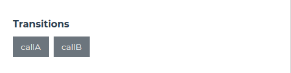

# Transitions & Procedures
Transitions and procedures are essential components of a Scilla contract. They are basically contract calls with different "visibility".

## Transitions
A transition is defined by using the keyword: `transition`.

A transition is a contract call which is similar to a function call in other languages. A transition call is available to the "public"; users can call them directly via Neo Savant IDE or using Zilliqa SDKs.

#### Syntax
```
  transition transitionName()
    (* do something *)
  end
```

#### Example
```
  transition callA ()
    e = {_eventname: "callB"; msg: "I am a transition call"};
    event e
  end
```

In the above example, `transition callA()` will output an event. An event in Scilla is something like `console.log()` in Javascript. For more information about events, see [**Events & Errors**](./events_errors).

## Procedures
A procedure is defined by using the keyword: `procedure`.

A procedure is also a contract call. It is identical in functionality to a `transition`. The main difference is that a procedure can only be invoked from a transition. A procedure is sort of like a "private" function in some ways, users cannot call them directly.

#### Syntax
```
  procedure callC()
    e = {_eventname: "callC"; msg: "I am a procedure call"};
    event e
  end
```

#### Example
```
  procedure callC()
    e = {_eventname: "callC"; msg: "I am a procedure call"};
    event e
  end

  transition callA ()
    e = {_eventname: "callB"; msg: "I am a transition call"};
    event e
  end

  transition callB ()
    callC;
    e = {_eventname: "callB"; msg: "I am a transition call which invokes a procedure"};
    event e
  end
```

In the above example, transition `callA()` is a standalone transition that does not invoke any procedures while transition `callB()` is a transition call that invokes the procedure `callC`. 

If we deployed this code on Neo Savant IDE and observe the available transitions, you will notice that we can only invoke `callA()` and `callB()` but not `callC()` directly. This is because `callC()` is a procedure and procedures can only be accessed via a transition.



## Exercises

The following are some exercises to help you be familiar with transitions and procedures.

**Instructions**
- Download this [**HelloWorld Contract**](https://github.com/teye/zilliqa-tldr-dapp-course/blob/main/exercises/chapter1/ch01_transitions_procedures.scilla) to get started.

**Task**
- Deploy the contract on  [**Neo-Savant IDE**](https://ide.zilliqa.com/) on **Simulated Env**.
- Execute `callA()` and observe the transaction event logs.
- Execute `callB()` and observe the transaction event logs.
- You should notice that for `callB()`, there are additional event logs due to `callC()`. 